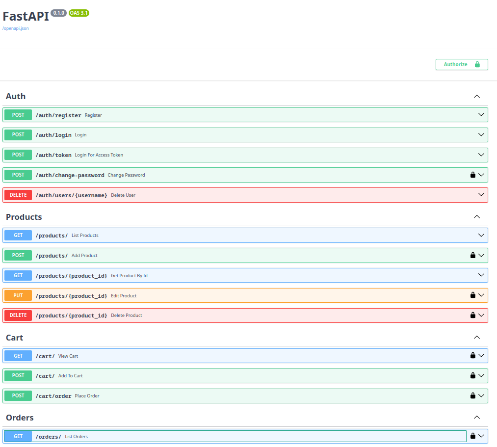

# Sobre o projeto

Para executar o projeto é necessario possuir a ferramenta docker.

Uma vez que você possua a ferramenta, clone este projeto, vá até a pasta raiz do projeto (pasta onde se encontra o arquivo `docker-compose.yml`) e execute o comando

`
docker-compose up -d --build
`

ao executar esse comando

Para interromper a aplicação basta usar o comando

`
docker-compose down
`

# Sobre o back end

# Sobre o front end

# Sobre o banco de dados

