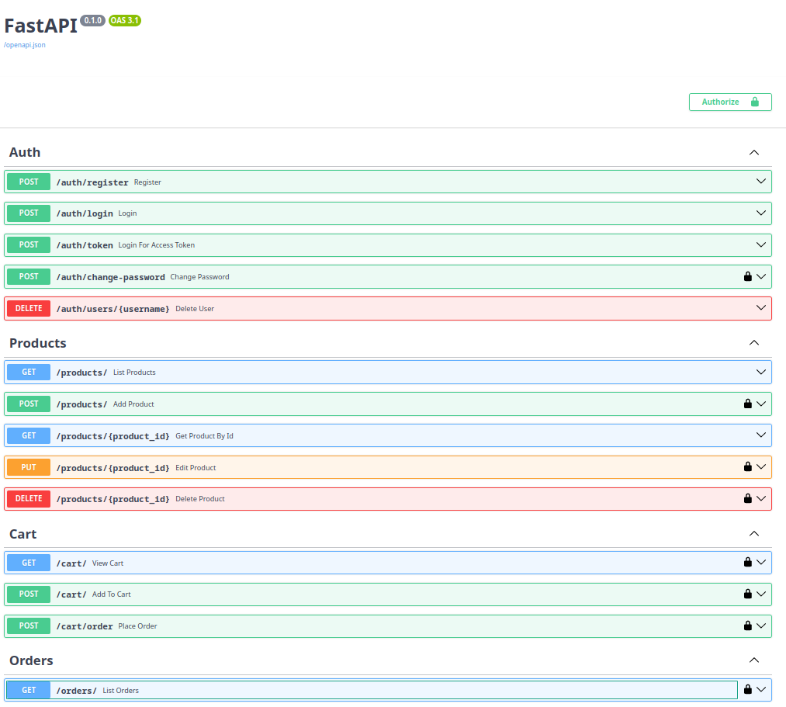
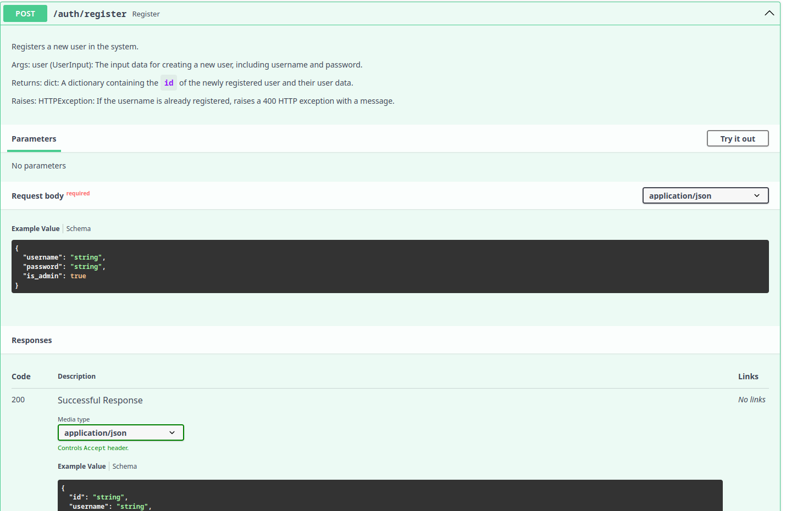
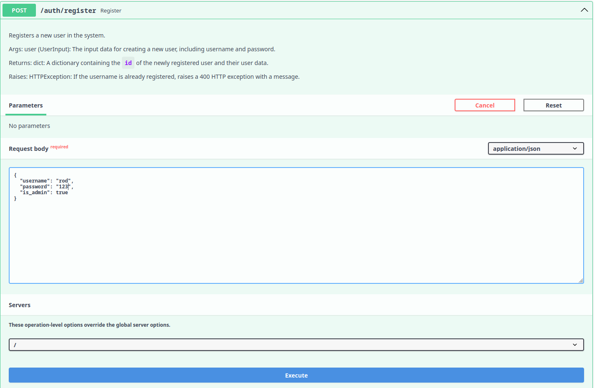
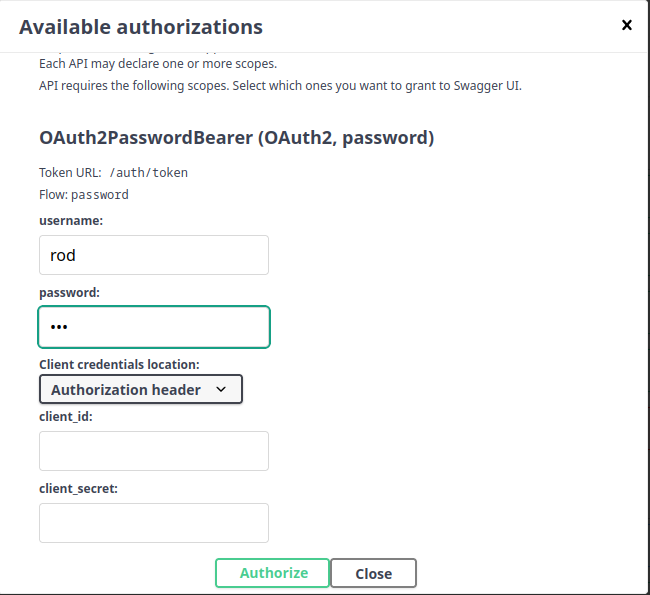
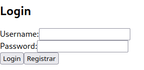
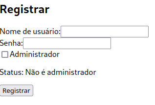
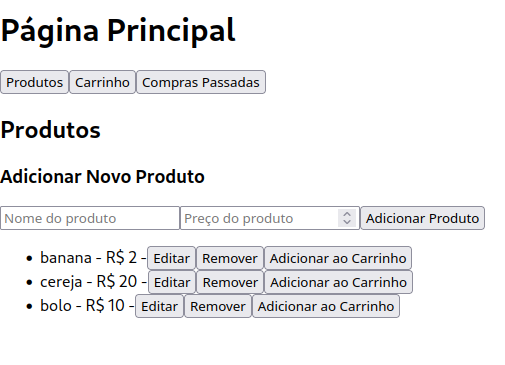
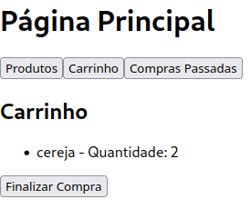
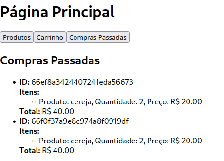

# README in English

## About the project

To run the project, you need to have Docker installed.

Once you have Docker, clone this project, navigate to the root folder of the project (the folder where the `docker-compose.yml` file is located), an run the command
```bash
docker-compose up backend frontend mongo --build
```
By executing this command, you will start three Docker images: the database, the backend, and the frontend. The frontend depends on the backend to run, and the backend depends on the database.

To stop the application, simply use the command
```bash
docker-compose down
```
This project was developed using the FARM stack (FastAPI, React, and MongoDB).

# About Docker Compose

Docker Compose orchestrates 5 containers: three are used for the application (Mongo, backend, frontend), and two are used for testing (mongo_test, test).


## About the backend

Once Docker is running, you can access the backend at [http://localhost:8000](http://localhost:8000) and access the backend Swagger at [http://localhost:8000/docs](http://localhost:8000/docs).

Below is an image of how Swagger appears:



To use a route, just click on the corresponding tab for the desired route.



Then click the "Try it out" button, which will reveal the parameters (for registration, there are none) and the body of the request to be filled out. After filling them in, simply click the "Execute" button.



Some routes are locked (these are indicated with a padlock icon on the right). To use them, you must first register a user and then click on one of the padlock icons or the "Authorize" button (located in the upper right corner of the page).

A form will appear:



Fill out the form with the credentials of the user you registered and click the "Authorize" button.

Now you can use the locked routes.

The product list is common to all users, but only admin users can add, remove, and edit products.

Each user can add products to their cart, which is unique to each user. They can view the items in their cart and complete the purchase, thereby clearing the user's cart and adding the transaction to the transaction list, which is also unique to each user.


### About testing the backend

To run the tests, it is also necessary to have Docker.

To execute the tests, simply run the following command:
```bash
docker-compose up --abort-on-container-exit test --build
```

This command will run two containers: one environment for the tests and a dedicated database environment for testing.

Detail about the tests: I encountered an issue with asynchronicity and couldn't resolve it in time. Therefore, all the tests are in the same function. For future work, I will fix this problem and separate the test functions.


## About the frontend

Once Docker is running, you can access the frontend at [http://localhost:3000](http://localhost:3000).

The first page is the Login page, where you can log in or click to register.



The registration screen has the necessary fields to register a user in the database.



The main page is divided into three tabs. The first tab is the products tab, where you can add, remove, and edit products if you are an admin. You can also add products to the cart.



In the Cart tab, you can view your cart and complete the purchase, which clears your cart and adds a new order to your history.



Finally, in the Past Purchases tab, you can view your purchase history.



## About the database

The database is called ecom_db.

It contains 4 collections:

Users defined by the schema:
```plaintext
_id: ObjectId  
username: string  
password: string (hashed)  
is_admin: boolean  
```
Products:
```plaintext
_id: ObjectId  
name: string  
price: number  
```
Carts:
```plaintext
_id: ObjectId  
user_id: ObjectId  
products: [{  
    product_id: ObjectId  
    quantity: number  
}]  
```
Orders:
```plaintext
_id: ObjectId  
user_id: ObjectId  
products: [{  
    product_id: ObjectId  
    quantity: number  
}]  
```

## About my learning

I learned to use JWT, to perform user authentication, to separate data according to the user, and, curious about how this would be done in the front-end, I learned to develop a simple front-end that authenticates the user and displays the data related to them.

I was able to improve my knowledge of Docker and learn how to run tests in a container. Mongo-mock was considered, but using a real database seemed to make more sense.


## License

The project is licensed under the MIT license.


# README em Portugês

## Sobre o projeto

Para executar o projeto é necessario possuir a ferramenta docker.

Uma vez que você possua a ferramenta, clone este projeto, vá até a pasta raiz do projeto (pasta onde se encontra o arquivo `docker-compose.yml`) e execute ` comando
`

```bash
docker-compose up backend frontend mongo --build
```


ao executar esse comando você executará as três imagens do docker. a do banco de dados, a do backend e a do frontend. O frontend depende do backend para executar e o backend depende do banco de dados.

Para interromper a aplicação basta usar o comando


```bash
docker-compose down
```


Este projeto foi desenvolvido usando a stack FARM (FAstapi, React e Mongodb)

### Sobre o Docker Compose

O Docker Compose orquestra 5 contêineres: três são usados para a aplicação (Mongo, backend, frontend) e dois são utilizados para realizar testes (mongo_test, test).


## Sobre o back end

Uma vez que o docker esteja rodando, você pode acessar o backend pelo link [http://localhost:8000](http://localhost:8000) e acessar o o swagger do backend pelo link [http://localhost:8000/docs](http://localhost:8000/docs) 

Segue imagem de como o swagger se apresenta:


Para usar uma rota basta clicar na aba correspondende à rota desejada.


Depois clique no botão Try it out,
isso revelará os parametros (no caso de registro não há) e o corpo da requisição a serem preenchidos. Depois de preenchidos basta clicar no botão Execute.


Algumas rotas são bloqueadas(estas são indicadas com um icone de um cadeado mais à direita) para usa-las é necessario primeiro registrar um usuário e depois clicar em um dos icones de cadeado ou no botão Authorize (localizado no canto superior direito da página) 

Um formulario aparecerá 


Preencha o formulario com as credenciais do usuário que você registrou e clique no botão Authorize.

Agora você pode usar as rotas bloqueadas.

A lista de produtos é comum a todos os usuários, porém apenas usuários administradores podem adicionar, remover e editar produtos. 

Cada usuário pode adcionar produtos ao seu carrinho, que é único para cada usuário. Ver os itens em seu carrinho e finalizar a compra, limpando assim o carrinho do usuário. e adicionando a transação à lista de transações, esta lista também é única para cada usuário.

### Sobre testar o backend

Para realizar os testes também é necessario possuir docker

Para executar os testes basta executar o comando

```bash
docker-compose up --abort-on-container-exit test --build
```

Este comando irá rodar dois contêineres: um ambiente para os testes e um banco de dados dedicado para testes.

Detalhe sobre os testes: esbarrei em um problema de assincronismo e não consegui resolver a tempo. Portanto, todos os testes estão na mesma função. Para trabalhos futuros, irei corrigir esse problema e separar as funções de teste.


## Sobre o front end

Uma vez que o docker esteja rodando, você pode acessar o frontend pelo link [http://localhost:3000](http://localhost:3000)

A primeira página é o Login, nela voce pode logar ou clicar em registrar


A tela de registro, possui os campos necessários para registrar um usuario no banco de dados. 


A página principal é divida em três abas. A primeira é a aba de produtos, nesta aba é possível adicionar, remover e editar produtos caso você seja um administrador. Também é possivel adicionar produtos ao carrinho. 


Na aba Carrinho é possivel visualizar seu carrinho e finalizar compra, o que limpa seu carrinho e adiciona um novo pedido ao seu historico


Por fim na aba Compras passadas é possível visualizar o historico de compras 


## Sobre o banco de dados

O banco de dados é chamado ecom_db

Nele são salvos 4 collections

Users definido pelo esquema:


```plaintext
_id: ObjectId
username: string
password: string(hashed)
is_admin: boolean
```


Products:


```plaintext
_id: ObjectId
name: string
price: number
```


Carts


```plaintext
_id: ObjectId
user_id: ObjectId
products: [{
    product_id: ObjectId
    quantity: number
}]
```


Orders


```plaintext
_id: ObjectId
user_id: ObjectId
products: [{
    product_id: ObjectId
    quantity: number
}]
```

## Sobre meu aprendizado

Aprendi a usar JWT, a fazer autenticação de usuários, a separar os dados de acordo com o usuário e, curioso sobre como isso seria no front-end, aprendi a desenvolver um front-end simples que autentica o usuário e mostra os dados relacionados a ele.

Pude aprimorar meus conhecimentos relacionados ao docker e aprender acomo executar testes em um container. mongo-mock foi considerado mas usar um banco de dados real pareceu fazer mais sentido.


## Licença

O projeto é licenciado sob a licença MIT.


